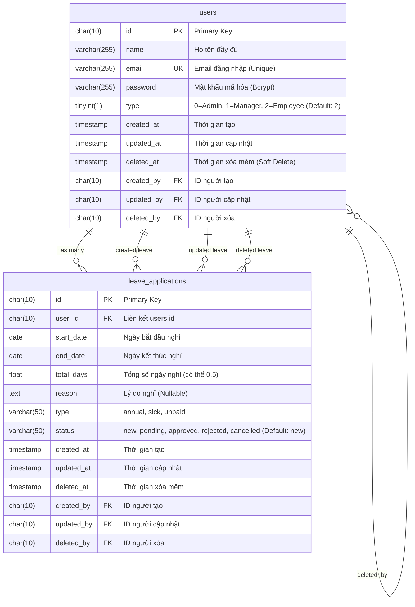

# ERD - Leave Application System

## Entity Relationship Diagram

## Giải thích Relationships

### 1. User hasMany LeaveApplication
- Một User (nhân viên) có thể tạo nhiều đơn nghỉ phép
- Mối quan hệ **One-to-Many** (1:N)
- Foreign Key: `leave_applications.user_id` → `users.id`

### 2. Audit Logs (Self-Referencing)
Cả 2 bảng đều có audit logs để tracking người thực hiện thao tác:
- `created_by` → User tạo record
- `updated_by` → User cập nhật record
- `deleted_by` → User xóa mềm record

Đây là **Self-Referencing Relationship**, một User có thể là người tạo/sửa/xóa nhiều records khác.

## Constraints & Indexes

### Table: users
- **Primary Key:** `id`
- **Unique Key:** `email`
- **Indexes:**
  - `id` (Primary)
  - `email` (Unique)
  - `type` (For role filtering)
  - `deleted_at` (For soft delete queries)

### Table: leave_applications
- **Primary Key:** `id`
- **Foreign Keys:**
  - `user_id` REFERENCES `users(id)` ON DELETE CASCADE
  - `created_by` REFERENCES `users(id)` ON DELETE SET NULL
  - `updated_by` REFERENCES `users(id)` ON DELETE SET NULL
  - `deleted_by` REFERENCES `users(id)` ON DELETE SET NULL
- **Indexes:**
  - `id` (Primary)
  - `user_id` (Foreign Key)
  - `status` (For status filtering)
  - `start_date`, `end_date` (For date range queries)
  - `deleted_at` (For soft delete queries)
  - Composite Index: `(user_id, start_date, end_date)` (For overlap checking)

## Database Rules

1. **Naming Convention:** `snake_case` cho tất cả tên bảng và cột
2. **Primary Key:** Sử dụng `CHAR(10)` thay vì BigInt auto-increment
3. **Timestamps:** Tất cả bảng đều có `created_at`, `updated_at`, `deleted_at`
4. **Soft Delete:** Sử dụng `deleted_at` để xóa mềm, không xóa vật lý
5. **Audit Logs:** Tracking người tạo/sửa/xóa qua `created_by`, `updated_by`, `deleted_by`
6. **Collation:** `utf8mb4_unicode_ci` cho hỗ trợ tiếng Việt và emoji

## Enum Values

### users.type
| Value | Role | Mô tả |
|-------|------|-------|
| 0 | Admin | Quản trị viên - Toàn quyền |
| 1 | Manager | Quản lý - Duyệt đơn |
| 2 | Employee | Nhân viên - Tạo đơn (Default) |

### leave_applications.type
| Value | Loại nghỉ |
|-------|-----------|
| annual | Nghỉ phép năm |
| sick | Nghỉ ốm |
| unpaid | Nghỉ không lương |

### leave_applications.status
| Value | Trạng thái | Mô tả |
|-------|-----------|-------|
| new | Mới tạo | Đơn vừa được tạo (Default) |
| pending | Chờ duyệt | Đơn đang chờ Manager/Admin duyệt |
| approved | Đã duyệt | Đơn được chấp thuận |
| rejected | Từ chối | Đơn bị từ chối |
| cancelled | Đã hủy | Nhân viên tự hủy đơn |
