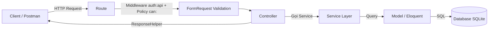
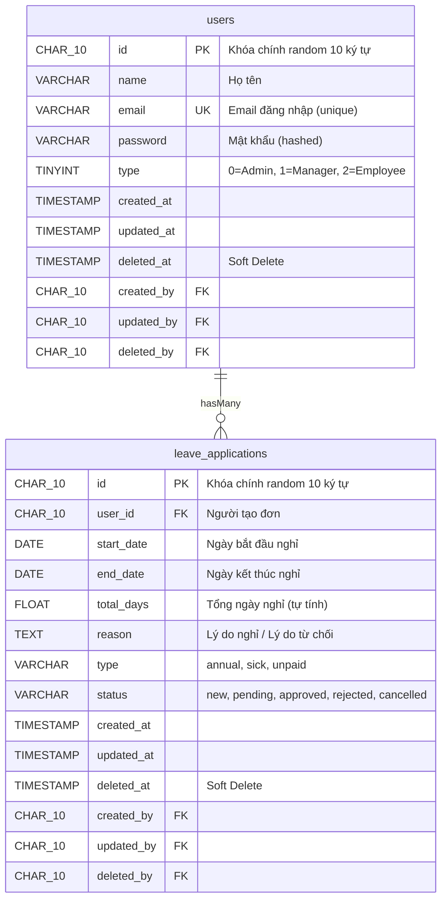
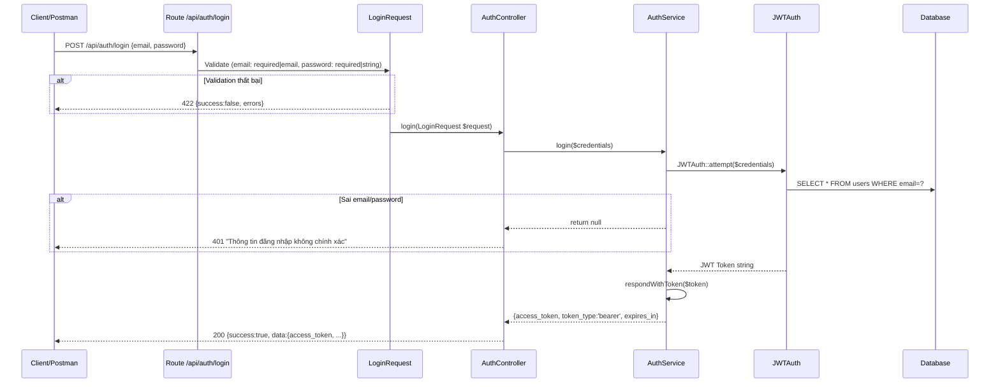
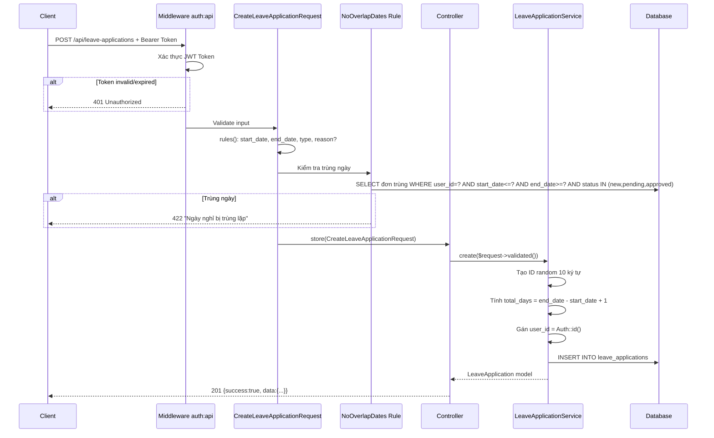
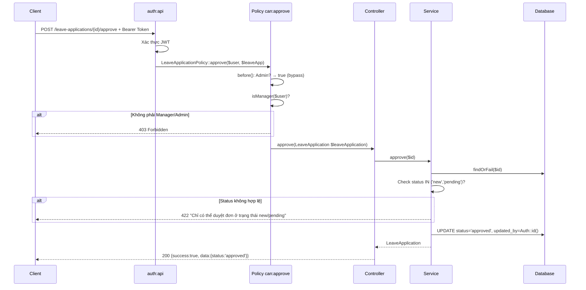
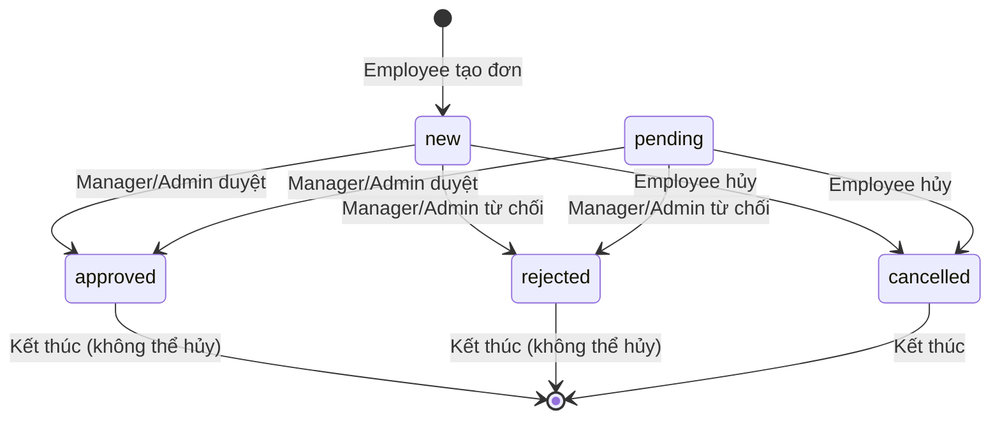
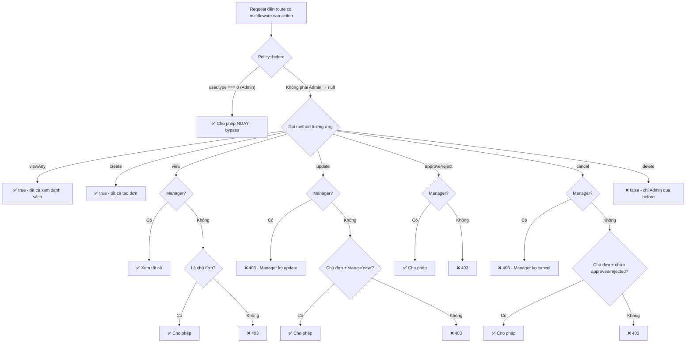

# 🎓 LEAVE APPLICATION SYSTEM — TÀI LIỆU THUYẾT TRÌNH TOÀN DIỆN

> Hệ thống quản lý đơn xin nghỉ phép — Laravel Backend API

---

## MỤC LỤC

0. [Từ khóa & Thuật ngữ](#0-từ-khóa--thuật-ngữ)
1. [Chi tiết File & Thư mục](#1-chi-tiết-file--thư-mục)
2. [Tổng quan hệ thống](#2-tổng-quan-hệ-thống)
3. [Chức năng toàn bộ hệ thống](#3-chức-năng-toàn-bộ-hệ-thống)
4. [API — Mô tả chức năng](#4-api--mô-tả-chức-năng)
5. [Luồng hoạt động](#5-luồng-hoạt-động)
6. [Chi tiết hàm & Checklist hoàn thành](#6-chi-tiết-hàm--checklist-hoàn-thành)
7. [Debug với Xdebug & Test với Postman](#7-debug-với-xdebug--test-với-postman)

---

## 0. TỪ KHÓA & THUẬT NGỮ

### Kiến trúc & Design Pattern

| Từ khóa | Giải thích |
|---------|-----------|
| **MVC** (Model-View-Controller) | Mô hình kiến trúc chia code thành 3 lớp: **Model** (dữ liệu + database), **View** (giao diện — ở đây là JSON response vì là API), **Controller** (nhận request, điều phối xử lý). Trong project này mở rộng thêm **Service Layer** |
| **Service Layer** | Lớp trung gian nằm giữa Controller và Model. Chứa toàn bộ **logic nghiệp vụ** (business logic) như tính toán, kiểm tra quyền, validate dữ liệu phức tạp. Giúp Controller "mỏng" — chỉ nhận request/trả response |
| **RESTful API** | Quy ước thiết kế API dùng HTTP methods (GET, POST, PUT, DELETE) tương ứng với CRUD (Create, Read, Update, Delete). URL đại diện cho resource (ví dụ `/leave-applications`) |
| **Middleware** | Code chạy **trước khi** request đến Controller. Dùng để kiểm tra xác thực (auth), phân quyền (can:), log, CORS... Giống như "cổng bảo vệ" cho routes |
| **Policy** | Cơ chế phân quyền của Laravel. Mỗi Policy gắn với 1 Model, định nghĩa **ai được làm gì** với model đó. Ví dụ: `LeaveApplicationPolicy::approve()` quyết định ai được duyệt đơn |
| **Route Model Binding** | Laravel tự động chuyển `{leaveApplication}` trong URL thành object [LeaveApplication](file:///c:/laragon/www/leave-system/backend/app/Models/LeaveApplication.php#15-54) model bằng cách `findOrFail(id)`. Không cần viết `LeaveApplication::find($id)` thủ công |
| **Form Request** | Class chuyên validate input. Chạy **trước Controller** → nếu validate fail thì trả 422 luôn, không vào Controller |
| **Enum** | Kiểu dữ liệu liệt kê các giá trị cố định. Ví dụ: `UserType` chỉ có 3 giá trị (ADMIN=0, MANAGER=1, EMPLOYEE=2). Dùng thay cho "magic number" |
| **DRY** (Don't Repeat Yourself) | Nguyên tắc: không viết lại code giống nhau nhiều lần. Extract thành function dùng chung. Ví dụ: [isAdmin()](file:///c:/laragon/www/leave-system/backend/app/Policies/LeaveApplicationPolicy.php#19-23), [isManager()](file:///c:/laragon/www/leave-system/backend/app/Services/LeaveApplicationService.php#35-39) dùng ở cả Service và Policy |
| **SRP** (Single Responsibility) | Nguyên tắc: mỗi class chỉ đảm nhiệm **một nhiệm vụ**. Controller chỉ điều phối, Service chỉ xử lý logic, Request chỉ validate |

### Database & Eloquent ORM

| Từ khóa | Giải thích |
|---------|-----------|
| **Eloquent ORM** | Hệ thống ORM (Object-Relational Mapping) của Laravel. Map bảng database → PHP class. Viết code PHP thay vì SQL thuần. Ví dụ: `LeaveApplication::where('status', 'new')->get()` thay vì `SELECT * FROM leave_applications WHERE status='new'` |
| **Migration** | File PHP quản lý cấu trúc database. Thay vì chạy SQL tay, viết code PHP mô tả bảng → `php artisan migrate` tự tạo bảng. Có thể rollback (hủy) bằng `php artisan migrate:rollback` |
| **Seeder** | File PHP tạo dữ liệu mẫu cho database. Ví dụ tạo 5 users test. Chạy bằng `php artisan db:seed` |
| **$fillable** | Mảng khai báo các cột **được phép** mass-assign (gán hàng loạt). Bảo vệ khỏi mass-assignment vulnerability. Ví dụ: nếu `type` không có trong `$fillable`, thì `User::create(['type' => 0])` sẽ bỏ qua `type` |
| **$casts** | Tự động chuyển đổi kiểu dữ liệu khi đọc/ghi. Ví dụ: `'password' => 'hashed'` → tự hash khi gán giá trị. `'start_date' => 'date'` → tự chuyển sang Carbon object |
| **$hidden** | Mảng khai báo các cột **ẩn** khi serialize sang JSON. Ví dụ: `password` không bao giờ trả về trong API response |
| **SoftDeletes** | Trait cho phép "xóa mềm". Thay vì DELETE khỏi database, chỉ ghi timestamp vào cột `deleted_at`. Dữ liệu vẫn còn nhưng Eloquent tự lọc bỏ khi query |
| **Relationship** | Quan hệ giữa các Model: `hasMany` (1-nhiều: 1 User có nhiều LeaveApplication), `belongsTo` (ngược lại: 1 LeaveApplication thuộc 1 User) |
| **Eager Loading** (`with()`) | Kỹ thuật load quan hệ bằng 1 query thay vì N query. `LeaveApplication::with('user')` → 2 queries. Không dùng `with()` → 1 + N queries (N+1 problem) |
| **Foreign Key (FK)** | Ràng buộc khóa ngoại. `user_id` trong `leave_applications` tham chiếu đến [id](file:///c:/laragon/www/leave-system/backend/app/Rules/NoOverlapDates.php#29-57) trong `users`. Database đảm bảo không có `user_id` orphan |
| **Index** | Chỉ mục giúp tăng tốc truy vấn WHERE, ORDER BY. Ví dụ: index trên `status` → query `WHERE status='new'` nhanh hơn |
| **Composite Index** | Chỉ mục kết hợp nhiều cột. `idx_user_date_range(user_id, start_date, end_date)` tối ưu cho query kiểm tra trùng ngày |

### Authentication & Security

| Từ khóa | Giải thích |
|---------|-----------|
| **JWT** (JSON Web Token) | Chuẩn xác thực stateless. Sau khi login, server trả một token string → client lưu lại → gửi kèm mỗi request trong header `Authorization: Bearer {token}`. Server parse token để biết ai đang gọi API |
| **Bearer Token** | Cách gửi JWT trong HTTP header: `Authorization: Bearer eyJhbGciOi...`. "Bearer" nghĩa là "người mang token" |
| **Token Blacklist** | Khi logout, token bị thêm vào danh sách đen → không dùng được nữa dù chưa hết hạn |
| **Token Refresh** | Tạo token mới từ token cũ trước khi hết hạn. Token cũ bị hủy, token mới có thời hạn mới |
| **Hash** | Mã hóa một chiều. Password `password123` → `$2y$10$9Kx...` (không thể giải ngược). Dùng để lưu password an toàn |
| **CORS** (Cross-Origin Resource Sharing) | Cơ chế cho phép frontend ở domain khác (localhost:5173) gọi API ở domain khác (localhost:8000). Không có CORS → browser chặn request cross-origin |
| **Preflight Request** | Request `OPTIONS` tự động gửi bởi browser trước request thật (POST, PUT, DELETE) để hỏi server: "có cho phép cross-origin không?" |
| **SQL Injection** | Tấn công bằng cách chèn SQL vào input. Ví dụ: `email = "'; DROP TABLE users; --"`. Eloquent + parameter binding tự động ngăn chặn |
| **Mass Assignment** | Gán nhiều trường cùng lúc: `User::create($request->all())`. Nguy hiểm nếu không có `$fillable` — attacker có thể gán `type=0` để trở thành Admin |
| **Audit Trail** | Các cột `created_by`, `updated_by`, `deleted_by` ghi lại **ai** đã tạo/sửa/xóa record. Dùng cho truy vết và kiểm soát |

### Laravel Specific

| Từ khóa | Giải thích |
|---------|-----------|
| **`auth:api`** | Middleware xác thực JWT. Kiểm tra header Authorization có Bearer token hợp lệ không. Nếu không → 401 |
| **`can:action,model`** | Middleware phân quyền dùng Policy. `can:approve,leaveApplication` → gọi `LeaveApplicationPolicy::approve($user, $leaveApplication)` |
| **`Auth::user()`** | Lấy user hiện tại đang đăng nhập (từ JWT token). Trả về Model User |
| **`Auth::id()`** | Lấy ID của user hiện tại. Shorthand cho `Auth::user()->id` |
| **`findOrFail($id)`** | Tìm record theo ID. Nếu không tìm thấy → throw `ModelNotFoundException` → trả 404 |
| **`$request->validated()`** | Lấy dữ liệu đã qua validation từ Form Request. Chỉ trả fields đã khai báo trong [rules()](file:///c:/laragon/www/leave-system/backend/app/Http/Requests/RegisterRequest.php#17-43) |
| **`paginate(10)`** | Phân trang tự động: trả 10 records/page + metadata (total, current_page, last_page, per_page) |
| **`php artisan`** | CLI tool của Laravel. Các lệnh thường dùng: `migrate` (tạo bảng), `db:seed` (tạo data mẫu), `serve` (chạy server), `tinker` (PHP REPL) |
| **[before()](file:///c:/laragon/www/leave-system/backend/app/Policies/LeaveApplicationPolicy.php#39-48)** | Method đặc biệt trong Policy. Chạy **trước** tất cả method khác. Nếu return `true` → bypass (cho phép ngay), `null` → chạy tiếp method tương ứng |
| **Gate** | Facade dùng để đăng ký Policy với Model: `Gate::policy(LeaveApplication::class, LeaveApplicationPolicy::class)` |
| **Trait** | PHP mechanism cho phép "mượn" code vào class. Ví dụ: `use SoftDeletes` thêm khả năng xóa mềm vào Model |
| **Carbon** | Thư viện xử lý ngày tháng trong PHP/Laravel. `Carbon::parse('2026-04-01')->diffInDays(...)` tính khoảng cách ngày |

### Coding Convention

| Từ khóa | Giải thích | Ví dụ |
|---------|-----------|-------|
| **snake_case** | Chữ thường, phân cách bằng `_`. Dùng cho: biến, cột database, tên bảng | `$leave_application`, `user_id`, `leave_applications` |
| **camelCase** | Chữ đầu thường, các từ sau viết hoa chữ đầu. Dùng cho: method/function | [getList()](file:///c:/laragon/www/leave-system/backend/app/Services/LeaveApplicationService.php#57-88), [getCurrentUser()](file:///c:/laragon/www/leave-system/backend/app/Services/LeaveApplicationService.php#25-29), [isManager()](file:///c:/laragon/www/leave-system/backend/app/Services/LeaveApplicationService.php#35-39) |
| **PascalCase** | Mỗi từ viết hoa chữ đầu. Dùng cho: class name | [LeaveApplicationController](file:///c:/laragon/www/leave-system/backend/app/Http/Controllers/LeaveApplicationController.php#17-92), [AuthService](file:///c:/laragon/www/leave-system/backend/app/Services/AuthService.php#14-90), [NoOverlapDates](file:///c:/laragon/www/leave-system/backend/app/Rules/NoOverlapDates.php#16-58) |
| **UPPER_SNAKE_CASE** | Toàn bộ viết hoa, phân cách `_`. Dùng cho: constant, enum case | `UserType::ADMIN`, `LeaveApplicationStatus::NEW` |
| **PSR-12** | Tiêu chuẩn code style cho PHP: indent 4 spaces, `{` xuống dòng cho class/method, không space thừa |

---

## 1. CHI TIẾT FILE & THƯ MỤC — VAI TRÒ TRONG HỆ THỐNG

### 1.1 Cấu trúc tổng quan

```
leave-system/
├── backend/                          # Toàn bộ Laravel API backend
│   ├── app/                          # Source code chính
│   ├── bootstrap/                    # Khởi tạo ứng dụng
│   ├── config/                       # Cấu hình (cors, auth, database...)
│   ├── database/                     # Migrations, seeders, factories
│   ├── routes/                       # Định nghĩa API endpoints
│   ├── public/                       # Entry point (index.php)
│   ├── storage/                      # Log, cache, file upload
│   ├── tests/                        # Unit & Feature tests
│   ├── vendor/                       # Packages (auto-generated bởi composer)
│   ├── .env                          # Biến môi trường (DB, JWT secret, APP_KEY)
│   ├── composer.json                 # Khai báo dependencies PHP
│   └── leave-system-postman.json     # Postman collection để test API
├── frontend/                         # Vue.js frontend
├── Dockerfile                        # Docker build
├── docker-entrypoint.sh              # Docker startup script
└── nginx.conf                        # Nginx config (dùng khi deploy)
```

### 1.2 Thư mục [app/](file:///c:/laragon/www/leave-system/backend/app/Services/LeaveApplicationService.php#159-179) — Chi tiết từng file

#### 📁 `app/Enums/` — Hằng số hệ thống

> Tại sao dùng Enum? Tránh "magic number/string" rải rác trong code. Thay vì viết `if ($user->type === 0)` (khó hiểu), viết `if ($user->type === UserType::ADMIN->value)` (rõ ràng).

| File | Vai trò | Giá trị |
|------|---------|---------|
| [UserType.php](file:///c:/laragon/www/leave-system/backend/app/Enums/UserType.php) | Định nghĩa 3 loại user trong hệ thống | `ADMIN=0` (Quản trị viên — toàn quyền), `MANAGER=1` (Quản lý — duyệt đơn), `EMPLOYEE=2` (Nhân viên — tạo đơn). Mỗi case có method [description()](file:///c:/laragon/www/leave-system/backend/app/Enums/LeaveApplicationType.php#15-23) trả tiếng Việt, [values()](file:///c:/laragon/www/leave-system/backend/app/Enums/LeaveApplicationType.php#24-28) trả mảng `[0,1,2]` |
| [LeaveApplicationStatus.php](file:///c:/laragon/www/leave-system/backend/app/Enums/LeaveApplicationStatus.php) | Định nghĩa 5 trạng thái đơn nghỉ phép | `NEW` (mới tạo), `PENDING` (chờ duyệt), `APPROVED` (đã duyệt), `REJECTED` (từ chối), `CANCELLED` (đã hủy). Luồng: new → pending → approved/rejected |
| [LeaveApplicationType.php](file:///c:/laragon/www/leave-system/backend/app/Enums/LeaveApplicationType.php) | Định nghĩa 3 loại nghỉ phép | `ANNUAL` (phép năm), `SICK` (nghỉ ốm), `UNPAID` (không lương) |

#### 📁 `app/Models/` — Đại diện cho bảng database

> Mỗi Model map tới 1 bảng. Laravel dùng Model để query, tạo, sửa, xóa dữ liệu thay vì viết SQL thuần.

| File | Bảng | Vai trò chi tiết |
|------|------|-----------------|
| [User.php](file:///c:/laragon/www/leave-system/backend/app/Models/User.php) | `users` | Đại diện user trong hệ thống. Implement `JWTSubject` → hỗ trợ JWT auth (method [getJWTIdentifier()](file:///c:/laragon/www/leave-system/backend/app/Models/User.php#51-56) trả primary key, [getJWTCustomClaims()](file:///c:/laragon/www/leave-system/backend/app/Models/User.php#57-64) thêm `type` vào token payload). Dùng `HasFactory` (cho testing), `Notifiable` (cho notification), `SoftDeletes` (xóa mềm). Khóa chính CHAR(10) random, không auto-increment. `$casts['password'] = 'hashed'` → tự hash khi gán password. Quan hệ [leaveApplications()](file:///c:/laragon/www/leave-system/backend/app/Models/User.php#67-72) → `hasMany` |
| [LeaveApplication.php](file:///c:/laragon/www/leave-system/backend/app/Models/LeaveApplication.php) | `leave_applications` | Đại diện đơn xin nghỉ phép. Dùng `SoftDeletes`. Khóa chính CHAR(10) random. `$casts` đảm bảo `start_date/end_date` là Carbon date, `total_days` là float. Quan hệ [user()](file:///c:/laragon/www/leave-system/backend/app/Models/LeaveApplication.php#48-53) → `belongsTo` (1 đơn thuộc 1 user) |

#### 📁 `app/Services/` — Logic nghiệp vụ (Business Logic)

> Đây là "não" của hệ thống. Controller KHÔNG chứa logic — chỉ gọi Service. Lợi ích: dễ test, dễ tái sử dụng, code rõ ràng.

| File | Vai trò chi tiết |
|------|-----------------|
| [AuthService.php](file:///c:/laragon/www/leave-system/backend/app/Services/AuthService.php) | Xử lý logic xác thực: [register()](file:///c:/laragon/www/leave-system/backend/app/Providers/AppServiceProvider.php#12-16) tạo user mới + trả JWT token, [login()](file:///c:/laragon/www/leave-system/backend/app/Http/Controllers/AuthController.php#35-54) kiểm tra credentials + trả token, [logout()](file:///c:/laragon/www/leave-system/backend/app/Http/Controllers/AuthController.php#55-65) invalidate token, [refresh()](file:///c:/laragon/www/leave-system/backend/app/Services/AuthService.php#57-66) tạo token mới, [me()](file:///c:/laragon/www/leave-system/backend/app/Http/Controllers/AuthController.php#77-87) lấy user từ token. Method [respondWithToken()](file:///c:/laragon/www/leave-system/backend/app/Services/AuthService.php#75-89) format output chuẩn `{access_token, token_type, expires_in}` |
| [LeaveApplicationService.php](file:///c:/laragon/www/leave-system/backend/app/Services/LeaveApplicationService.php) | Xử lý toàn bộ logic đơn nghỉ phép. **6 helper methods** kiểm tra role ([isAdmin()](file:///c:/laragon/www/leave-system/backend/app/Policies/LeaveApplicationPolicy.php#19-23), [isManager()](file:///c:/laragon/www/leave-system/backend/app/Services/LeaveApplicationService.php#35-39), [isEmployee()](file:///c:/laragon/www/leave-system/backend/app/Policies/LeaveApplicationPolicy.php#29-33), [isManagerOrAdmin()](file:///c:/laragon/www/leave-system/backend/app/Services/LeaveApplicationService.php#45-49), [isOwner()](file:///c:/laragon/www/leave-system/backend/app/Policies/LeaveApplicationPolicy.php#34-38), [getCurrentUser()](file:///c:/laragon/www/leave-system/backend/app/Services/LeaveApplicationService.php#25-29)). **4 CRUD methods** ([getList](file:///c:/laragon/www/leave-system/backend/app/Services/LeaveApplicationService.php#57-88) với filter + phân trang + employee chỉ thấy đơn mình, [getDetail](file:///c:/laragon/www/leave-system/backend/app/Services/LeaveApplicationService.php#89-96) eager load user, [create](file:///c:/laragon/www/leave-system/backend/app/Services/LeaveApplicationService.php#97-115) tự sinh ID + tính `total_days` + gán `user_id`, [update](file:///c:/laragon/www/leave-system/backend/app/Http/Controllers/LeaveApplicationController.php#51-58) check status='new' + tính lại total_days, [delete](file:///c:/laragon/www/leave-system/backend/app/Services/LeaveApplicationService.php#144-156) ghi `deleted_by` rồi soft delete). **3 action methods** ([approve](file:///c:/laragon/www/leave-system/backend/app/Services/LeaveApplicationService.php#159-179) chuyển status='approved', [reject](file:///c:/laragon/www/leave-system/backend/app/Policies/LeaveApplicationPolicy.php#97-102) chuyển status='rejected' + ghi reason, [cancel](file:///c:/laragon/www/leave-system/backend/app/Services/LeaveApplicationService.php#202-222) chuyển status='cancelled') |

#### 📁 `app/Http/Controllers/` — Bộ điều phối Request/Response

> Nguyên tắc: Controller phải **mỏng** (thin controller). Mỗi method chỉ 3-5 dòng: nhận request → gọi service → trả response.

| File | Vai trò chi tiết |
|------|-----------------|
| [Controller.php](file:///c:/laragon/www/leave-system/backend/app/Http/Controllers/Controller.php) | Base controller (class cha). Các controller khác kế thừa từ đây |
| [AuthController.php](file:///c:/laragon/www/leave-system/backend/app/Http/Controllers/AuthController.php) | 5 methods: [register()](file:///c:/laragon/www/leave-system/backend/app/Providers/AppServiceProvider.php#12-16) nhận RegisterRequest → gọi AuthService → 201, [login()](file:///c:/laragon/www/leave-system/backend/app/Http/Controllers/AuthController.php#35-54) nhận LoginRequest → gọi AuthService → 200 hoặc 401, [logout()](file:///c:/laragon/www/leave-system/backend/app/Http/Controllers/AuthController.php#55-65) gọi AuthService → 200, [refresh()](file:///c:/laragon/www/leave-system/backend/app/Services/AuthService.php#57-66) gọi AuthService → 200, [me()](file:///c:/laragon/www/leave-system/backend/app/Http/Controllers/AuthController.php#77-87) gọi AuthService → 200. Inject [AuthService](file:///c:/laragon/www/leave-system/backend/app/Services/AuthService.php#14-90) qua constructor dependency injection |
| [LeaveApplicationController.php](file:///c:/laragon/www/leave-system/backend/app/Http/Controllers/LeaveApplicationController.php) | 8 methods: [index()](file:///c:/laragon/www/leave-system/backend/app/Http/Controllers/LeaveApplicationController.php#26-34) lấy danh sách (filters từ query params), [show()](file:///c:/laragon/www/leave-system/backend/app/Http/Controllers/LeaveApplicationController.php#35-42) chi tiết 1 đơn (dùng Route Model Binding), [store()](file:///c:/laragon/www/leave-system/backend/app/Http/Controllers/LeaveApplicationController.php#43-50) tạo đơn (nhận CreateLeaveApplicationRequest), [update()](file:///c:/laragon/www/leave-system/backend/app/Http/Controllers/LeaveApplicationController.php#51-58) cập nhật (nhận UpdateLeaveApplicationRequest), [destroy()](file:///c:/laragon/www/leave-system/backend/app/Http/Controllers/LeaveApplicationController.php#59-66) xóa mềm, [approve()](file:///c:/laragon/www/leave-system/backend/app/Services/LeaveApplicationService.php#159-179) duyệt, [reject()](file:///c:/laragon/www/leave-system/backend/app/Policies/LeaveApplicationPolicy.php#97-102) từ chối (nhận RejectLeaveRequest), [cancel()](file:///c:/laragon/www/leave-system/backend/app/Services/LeaveApplicationService.php#202-222) hủy. Inject [LeaveApplicationService](file:///c:/laragon/www/leave-system/backend/app/Services/LeaveApplicationService.php#21-223) qua constructor |

#### 📁 `app/Http/Requests/` — Validation Input

> Mỗi class validate input cho 1 API cụ thể. Chạy **trước Controller** → nếu fail trả 422 ngay. Lợi ích: Controller sạch, validation tập trung 1 chỗ, có custom messages tiếng Việt.

| File | API tương ứng | Vai trò chi tiết |
|------|--------------|-----------------|
| [LoginRequest.php](file:///c:/laragon/www/leave-system/backend/app/Http/Requests/LoginRequest.php) | POST `/auth/login` | Validate: `email` (required, email format), `password` (required, string). Không check `exists:users` vì lý do bảo mật (không leak email nào đã tồn tại). Messages song ngữ Việt/Anh |
| [RegisterRequest.php](file:///c:/laragon/www/leave-system/backend/app/Http/Requests/RegisterRequest.php) | POST `/auth/register` | Validate: `name` (required, max 255), `email` (required, unique:users — kiểm tra chưa dùng), `password` (required, min 6, confirmed — cần `password_confirmation` khớp), `type` (sometimes, in:0,1,2 — optional) |
| [CreateLeaveApplicationRequest.php](file:///c:/laragon/www/leave-system/backend/app/Http/Requests/CreateLeaveApplicationRequest.php) | POST `/leave-applications` | Validate: `start_date` (required, date, after_or_equal:today — không cho nghỉ ngày quá khứ, [NoOverlapDates](file:///c:/laragon/www/leave-system/backend/app/Rules/NoOverlapDates.php#16-58) — kiểm tra trùng), `end_date` (required, after_or_equal:start_date), `reason` (nullable, max 1000), `type` (required, in:annual,sick,unpaid) |
| [UpdateLeaveApplicationRequest.php](file:///c:/laragon/www/leave-system/backend/app/Http/Requests/UpdateLeaveApplicationRequest.php) | PUT `/leave-applications/{id}` | Giống Create nhưng dùng `sometimes` (chỉ validate field gửi lên — partial update). [NoOverlapDates](file:///c:/laragon/www/leave-system/backend/app/Rules/NoOverlapDates.php#16-58) nhận thêm `$exclude_id` = ID đơn đang sửa (không tự check ngày trùng với chính nó) |
| [RejectLeaveRequest.php](file:///c:/laragon/www/leave-system/backend/app/Http/Requests/RejectLeaveRequest.php) | POST `/{id}/reject` | Validate: `reason` (required, string, max 1000) — bắt buộc phải có lý do từ chối |

#### 📁 `app/Http/Middleware/` — Bộ lọc Request

| File | Vai trò chi tiết |
|------|-----------------|
| [CheckRole.php](file:///c:/laragon/www/leave-system/backend/app/Http/Middleware/CheckRole.php) | Custom middleware kiểm tra role. Sử dụng: `Route::middleware('role:admin,manager')`. **Logic:** Admin (type=0) luôn pass → gọi [mapRolesToTypes()](file:///c:/laragon/www/leave-system/backend/app/Http/Middleware/CheckRole.php#41-60) chuyển tên role ('admin','manager','employee') thành số (0,1,2) → check `user->type` có nằm trong danh sách cho phép không. Nếu không → 403. **Lưu ý:** Trong project hiện tại, Policy (`can:`) được dùng nhiều hơn middleware `role:` |

#### 📁 `app/Policies/` — Phân quyền

| File | Vai trò chi tiết |
|------|-----------------|
| [LeaveApplicationPolicy.php](file:///c:/laragon/www/leave-system/backend/app/Policies/LeaveApplicationPolicy.php) | Định nghĩa **ai được làm gì** với LeaveApplication. **[before()](file:///c:/laragon/www/leave-system/backend/app/Policies/LeaveApplicationPolicy.php#39-48)** — Admin (type=0) return true → bypass tất cả. **[viewAny()](file:///c:/laragon/www/leave-system/backend/app/Policies/LeaveApplicationPolicy.php#49-54)** — true (tất cả xem, Service sẽ filter). **[create()](file:///c:/laragon/www/leave-system/backend/app/Services/LeaveApplicationService.php#97-115)** — true (tất cả tạo). **[view()](file:///c:/laragon/www/leave-system/backend/app/Policies/LeaveApplicationPolicy.php#61-70)** — Manager xem mọi đơn, Employee chỉ xem đơn mình. **[update()](file:///c:/laragon/www/leave-system/backend/app/Http/Controllers/LeaveApplicationController.php#51-58)** — Manager KHÔNG được update, Employee update khi là chủ đơn + status='new'. **[delete()](file:///c:/laragon/www/leave-system/backend/app/Services/LeaveApplicationService.php#144-156)** — false (chỉ Admin qua before). **[approve()/reject()](file:///c:/laragon/www/leave-system/backend/app/Services/LeaveApplicationService.php#159-179)** — chỉ Manager. **[cancel()](file:///c:/laragon/www/leave-system/backend/app/Services/LeaveApplicationService.php#202-222)** — Manager KHÔNG được cancel, Employee cancel khi là chủ đơn + đơn chưa approved/rejected |

#### 📁 `app/Rules/` — Custom Validation Rules

| File | Vai trò chi tiết |
|------|-----------------|
| [NoOverlapDates.php](file:///c:/laragon/www/leave-system/backend/app/Rules/NoOverlapDates.php) | Kiểm tra ngày nghỉ có trùng với đơn đang active không. **Thuật toán:** 2 khoảng [A1,A2] và [B1,B2] trùng nếu `A1 <= B2 AND A2 >= B1`. **Query:** tìm đơn cùng `user_id`, trùng ngày, status IN (new, pending, approved), chưa bị xóa mềm. Constructor nhận `$startDate`, `$endDate`, `$excludeId` (loại trừ đơn đang sửa khi update) |

#### 📁 `app/Helpers/` — Utility Functions

| File | Vai trò chi tiết |
|------|-----------------|
| [ResponseHelper.php](file:///c:/laragon/www/leave-system/backend/app/Helpers/ResponseHelper.php) | Format tất cả API response theo chuẩn thống nhất. 2 static methods: [success($message, $data, $statusCode)](file:///c:/laragon/www/leave-system/backend/app/Helpers/ResponseHelper.php#13-22) → `{success:true, message, data}`, [error($message, $data, $statusCode)](file:///c:/laragon/www/leave-system/backend/app/Helpers/ResponseHelper.php#23-32) → `{success:false, message, data}`. Đảm bảo frontend luôn nhận cùng format |

#### 📁 `app/Providers/` — Đăng ký Services

> Providers là nơi Laravel khởi tạo và đăng ký các dependencies khi ứng dụng boot.

| File | Vai trò chi tiết |
|------|-----------------|
| [AppServiceProvider.php](file:///c:/laragon/www/leave-system/backend/app/Providers/AppServiceProvider.php) | **boot():** Đăng ký Policy qua `Gate::policy()` + đăng ký Route Model Binding thủ công cho [leaveApplication](file:///c:/laragon/www/leave-system/backend/app/Models/User.php#67-72) (bắt buộc vì dùng CHAR(10) ID thay vì auto-increment — nếu không thì `{leaveApplication}` trong route không resolve được → Policy check fail → 403) |
| [AuthServiceProvider.php](file:///c:/laragon/www/leave-system/backend/app/Providers/AuthServiceProvider.php) | Khai báo mapping `$policies`: `LeaveApplication::class => LeaveApplicationPolicy::class`. Gọi `registerPolicies()` trong boot |

### 1.3 Thư mục `bootstrap/`

| File | Vai trò chi tiết |
|------|-----------------|
| [app.php](file:///c:/laragon/www/leave-system/backend/bootstrap/app.php) | **File cấu hình trung tâm** của Laravel. 3 phần cốt lõi: **(1) withRouting** — load route files từ [routes/apis/auth.php](file:///c:/laragon/www/leave-system/backend/routes/apis/auth.php) và [routes/apis/leaveApplication.php](file:///c:/laragon/www/leave-system/backend/routes/apis/leaveApplication.php) với prefix `api` + middleware group `api`. **(2) withMiddleware** — đăng ký alias `role` cho CheckRole, cấu hình redirect cho API guests (trả JSON 401 thay vì redirect sang /login). **(3) withExceptions** — xử lý 8 loại exception: AuthenticationException→401, TokenExpired→401, TokenInvalid→401, JWTException→401, AccessDenied→403, ModelNotFound→404, NotFound→404, Validation→422, UnprocessableEntity→422. Tất cả đều trả JSON format chuẩn |

### 1.4 Thư mục `routes/apis/`

| File | Vai trò chi tiết |
|------|-----------------|
| [auth.php](file:///c:/laragon/www/leave-system/backend/routes/apis/auth.php) | Định nghĩa 5 route Auth với prefix `/auth`. **Public** (không cần token): POST `/register`, POST `/login`. **Protected** (cần JWT token, middleware `auth:api`): POST `/logout`, POST `/refresh`, GET `/me` |
| [leaveApplication.php](file:///c:/laragon/www/leave-system/backend/routes/apis/leaveApplication.php) | Định nghĩa 8 route Leave Application với prefix `/leave-applications`. **Tất cả cần `auth:api`**. Các route có Policy middleware: `can:view` (show), `can:update` (update), `can:delete` (destroy), `can:approve` (approve), `can:reject` (reject), `can:cancel` (cancel). Route [index](file:///c:/laragon/www/leave-system/backend/app/Http/Controllers/LeaveApplicationController.php#26-34) và [store](file:///c:/laragon/www/leave-system/backend/app/Http/Controllers/LeaveApplicationController.php#43-50) không có Policy middleware (index → Service tự filter, store → tất cả đều tạo được) |

### 1.5 Thư mục `database/`

| File/Thư mục | Vai trò chi tiết |
|-------------|-----------------|
| [migrations/create_users_table.php](file:///c:/laragon/www/leave-system/backend/database/migrations/2026_01_27_015556_create_users_table.php) | Tạo bảng `users`: khóa chính CHAR(10), email unique, type tinyInteger default 2 (Employee), 3 cột audit (created_by/updated_by/deleted_by) với FK tự tham chiếu, index trên `type` và `deleted_at` |
| [migrations/create_leave_applications_table.php](file:///c:/laragon/www/leave-system/backend/database/migrations/2026_01_27_015620_create_leave_applications_table.php) | Tạo bảng `leave_applications`: khóa chính CHAR(10), FK `user_id` → `users.id` (ON DELETE CASCADE), status default 'new', 5 single indexes + 1 composite index `idx_user_date_range` cho overlap check |
| [seeders/UserSeeder.php](file:///c:/laragon/www/leave-system/backend/database/seeders/UserSeeder.php) | Tạo 5 users mẫu: 1 Admin (admin@example.com), 2 Managers (manager1/2@example.com), 2 Employees (employee1/2@example.com). Password chung: `password123`. ID random CHAR(10) |
| [seeders/DatabaseSeeder.php](file:///c:/laragon/www/leave-system/backend/database/seeders/DatabaseSeeder.php) | Seeder chính, gọi UserSeeder. Chạy `php artisan db:seed` sẽ gọi file này |

### 1.6 Các file cấu hình quan trọng ([config/](file:///c:/laragon/www/leave-system/backend/.editorconfig))

| File | Vai trò |
|------|---------|
| [cors.php](file:///c:/laragon/www/leave-system/backend/config/cors.php) | CORS: `paths` = api/*, `allowed_origins/methods/headers` = * (cho phép tất cả — dev mode). Production nên giới hạn `allowed_origins` |
| [.env](file:///c:/laragon/www/leave-system/backend/.env) | Biến môi trường: `DB_CONNECTION`, `DB_DATABASE`, `JWT_SECRET`, `APP_KEY`, `APP_URL`. File này **không** push lên Git |
| [composer.json](file:///c:/laragon/www/leave-system/backend/composer.json) | Khai báo dependencies: `laravel/framework`, `php-open-source-saver/jwt-auth`, `tymon/jwt-auth`... |

### 1.7 Các file cấp project

| File | Vai trò |
|------|---------|
| [leave-system-postman.json](file:///c:/laragon/www/leave-system/backend/leave-system-postman.json) | Postman collection chứa tất cả API endpoints đã config sẵn. Import vào Postman để test ngay |
| [Dockerfile](file:///c:/laragon/www/leave-system/Dockerfile) | Đóng gói ứng dụng thành Docker image để deploy |
| [docker-entrypoint.sh](file:///c:/laragon/www/leave-system/docker-entrypoint.sh) | Script khởi tạo khi container Docker start |
| [nginx.conf](file:///c:/laragon/www/leave-system/nginx.conf) | Cấu hình Nginx reverse proxy khi deploy production |

---

## 2. TỔNG QUAN HỆ THỐNG

### 1.1 Kiến trúc MVC + Service Layer



**Luồng tổng quát:** `Client → Route → Middleware → FormRequest → Controller → Service → Model → Database`

### 1.2 Cấu trúc thư mục

```
backend/app/
├── Enums/                       # Hằng số hệ thống
│   ├── UserType.php             # Admin(0), Manager(1), Employee(2)
│   ├── LeaveApplicationStatus.php # new, pending, approved, rejected, cancelled
│   └── LeaveApplicationType.php   # annual, sick, unpaid
├── Helpers/
│   └── ResponseHelper.php       # Format response chuẩn {success, message, data}
├── Http/
│   ├── Controllers/
│   │   ├── AuthController.php         # 5 actions: register, login, logout, refresh, me
│   │   └── LeaveApplicationController.php # 8 actions: index, show, store, update, destroy, approve, reject, cancel
│   ├── Middleware/
│   │   └── CheckRole.php        # Middleware role:admin,manager,employee
│   └── Requests/                # Form Request Validation
│       ├── LoginRequest.php
│       ├── RegisterRequest.php
│       ├── CreateLeaveApplicationRequest.php
│       ├── UpdateLeaveApplicationRequest.php
│       └── RejectLeaveRequest.php
├── Models/
│   ├── User.php                 # JWTSubject, hasMany LeaveApplication
│   └── LeaveApplication.php     # SoftDeletes, belongsTo User
├── Policies/
│   └── LeaveApplicationPolicy.php # Phân quyền: view, create, update, delete, approve, reject, cancel
├── Providers/
│   ├── AppServiceProvider.php     # Đăng ký Policy + Route Model Binding
│   └── AuthServiceProvider.php    # Đăng ký Policy mapping
├── Rules/
│   └── NoOverlapDates.php       # Custom rule: kiểm tra trùng ngày nghỉ
└── Services/
    ├── AuthService.php          # Logic: register, login, logout, refresh, me
    └── LeaveApplicationService.php # Logic: CRUD + approve/reject/cancel
```

### 1.3 Database Schema (ERD)



**Indexes trên `leave_applications`:** `user_id`, `status`, `start_date`, `end_date`, `deleted_at`, composite `idx_user_date_range(user_id, start_date, end_date)`

---

## 2. CHỨC NĂNG TOÀN BỘ HỆ THỐNG

### 2.1 Module Authentication (Xác thực)

| # | Chức năng | Mô tả | File chính |
|---|-----------|-------|------------|
| 1 | **Đăng ký** | Tạo user mới, tự động hash password, trả JWT token | [AuthService.php](file:///c:/laragon/www/leave-system/backend/app/Services/AuthService.php#L20-L32) |
| 2 | **Đăng nhập** | Xác thực email/password, trả JWT token | [AuthService.php](file:///c:/laragon/www/leave-system/backend/app/Services/AuthService.php#L38-L47) |
| 3 | **Đăng xuất** | Vô hiệu hóa token (blacklist) | [AuthService.php](file:///c:/laragon/www/leave-system/backend/app/Services/AuthService.php#L52-L55) |
| 4 | **Refresh token** | Tạo token mới từ token cũ | [AuthService.php](file:///c:/laragon/www/leave-system/backend/app/Services/AuthService.php#L60-L65) |
| 5 | **Xem thông tin** | Lấy user hiện tại từ token | [AuthService.php](file:///c:/laragon/www/leave-system/backend/app/Services/AuthService.php#L70-L73) |

### 2.2 Module Leave Application (Đơn xin nghỉ phép)

| # | Chức năng | Mô tả | Ai được dùng |
|---|-----------|-------|-------------|
| 1 | **Xem danh sách** | Phân trang 10/page + filter (status, user_id, month, year) | Employee: chỉ đơn mình. Manager/Admin: tất cả |
| 2 | **Xem chi tiết** | Lấy 1 đơn kèm thông tin user (eager loading) | Employee: đơn mình. Manager/Admin: tất cả |
| 3 | **Tạo đơn** | Tạo đơn mới, tự tính total_days, check trùng ngày | Tất cả user |
| 4 | **Cập nhật** | Sửa đơn (chỉ status='new'), tính lại total_days | Chủ đơn + Admin |
| 5 | **Xóa (soft delete)** | Đánh dấu deleted_at, không xóa thật | Chỉ Admin |
| 6 | **Duyệt đơn** | Chuyển status → 'approved' | Manager + Admin |
| 7 | **Từ chối đơn** | Chuyển status → 'rejected' + lý do bắt buộc | Manager + Admin |
| 8 | **Hủy đơn** | Chuyển status → 'cancelled' (không hủy được đơn đã approved/rejected) | Chủ đơn + Admin |

### 2.3 Hệ thống phân quyền (3 roles)

| Role | Type | Quyền |
|------|------|-------|
| **Admin** | 0 | Toàn quyền (bypass tất cả policy qua [before()](file:///c:/laragon/www/leave-system/backend/app/Policies/LeaveApplicationPolicy.php#39-48)) |
| **Manager** | 1 | Xem tất cả đơn, Approve, Reject. **KHÔNG** được update/delete/cancel |
| **Employee** | 2 | CRUD đơn của mình (update chỉ khi status='new'), Cancel đơn mình |

### 2.4 Các tính năng kỹ thuật

| Tính năng | Cách thực hiện | File |
|-----------|---------------|------|
| **JWT Authentication** | Package `php-open-source-saver/jwt-auth`, token trong header `Authorization: Bearer {token}` | [User.php](file:///c:/laragon/www/leave-system/backend/app/Models/User.php) |
| **Soft Delete** | Trait `SoftDeletes`, cột `deleted_at` | [LeaveApplication.php](file:///c:/laragon/www/leave-system/backend/app/Models/LeaveApplication.php#L17) |
| **Validation** | Form Request classes + Custom Rule [NoOverlapDates](file:///c:/laragon/www/leave-system/backend/app/Rules/NoOverlapDates.php#16-58) | [Requests/](file:///c:/laragon/www/leave-system/backend/app/Http/Requests) |
| **Authorization** | Laravel Policy + `can:` middleware trên route | [LeaveApplicationPolicy.php](file:///c:/laragon/www/leave-system/backend/app/Policies/LeaveApplicationPolicy.php) |
| **Error Handling** | Exception Handler trong [bootstrap/app.php](file:///c:/laragon/www/leave-system/backend/bootstrap/app.php) | [app.php](file:///c:/laragon/www/leave-system/backend/bootstrap/app.php#L54-L135) |
| **Response Format** | `ResponseHelper::success()` / [error()](file:///c:/laragon/www/leave-system/backend/app/Helpers/ResponseHelper.php#23-32) → `{success, message, data}` | [ResponseHelper.php](file:///c:/laragon/www/leave-system/backend/app/Helpers/ResponseHelper.php) |
| **CORS** | Config [config/cors.php](file:///c:/laragon/www/leave-system/backend/config/cors.php), cho phép `*` (dev) | [cors.php](file:///c:/laragon/www/leave-system/backend/config/cors.php) |
| **Audit Trail** | Cột `created_by`, `updated_by`, `deleted_by` trên cả 2 bảng | Migration files |
| **Route Model Binding** | `{leaveApplication}` tự resolve thành Model | [AppServiceProvider.php](file:///c:/laragon/www/leave-system/backend/app/Providers/AppServiceProvider.php#L24) |
| **Eager Loading** | `with('user')` tránh N+1 query | [LeaveApplicationService.php](file:///c:/laragon/www/leave-system/backend/app/Services/LeaveApplicationService.php#L63) |
| **Eloquent Casting** | `$casts` cho dates, float, hashed password | Model files |

---

## 3. API — MÔ TẢ CHỨC NĂNG

### 3.1 Authentication APIs (`/api/auth`)

| Method | Endpoint | Auth | Request Body | Response | Status |
|--------|----------|------|-------------|----------|--------|
| POST | `/api/auth/register` | ❌ Không | `{name, email, password, password_confirmation, type?}` | `{access_token, token_type, expires_in}` | 201 |
| POST | `/api/auth/login` | ❌ Không | `{email, password}` | `{access_token, token_type, expires_in}` | 200 |
| POST | `/api/auth/logout` | ✅ Bearer Token | — | `null` | 200 |
| POST | `/api/auth/refresh` | ✅ Bearer Token | — | `{access_token, token_type, expires_in}` | 200 |
| GET | `/api/auth/me` | ✅ Bearer Token | — | `{id, name, email, type, ...}` | 200 |

### 3.2 Leave Application APIs (`/api/leave-applications`)

> ⚠️ **Tất cả endpoints dưới đây đều yêu cầu `Authorization: Bearer {token}`**

| Method | Endpoint | Middleware | Request | Response | Status |
|--------|----------|-----------|---------|----------|--------|
| GET | `/list` → `/api/leave-applications` | `auth:api` | Query: `?status=&user_id=&month=&year=` | Paginated list (10/page) | 200 |
| GET | `/{id}` → `/api/leave-applications/{id}` | `auth:api`, `can:view` | — | Chi tiết đơn + user | 200 |
| POST | `/create` → `/api/leave-applications` | `auth:api` | `{start_date, end_date, reason?, type}` | Đơn vừa tạo | 201 |
| PUT | `/update/{id}` → `/api/leave-applications/{id}` | `auth:api`, `can:update` | `{start_date?, end_date?, reason?, type?}` | Đơn đã cập nhật | 200 |
| DELETE | `/{id}` → `/api/leave-applications/{id}` | `auth:api`, `can:delete` | — | `null` | 200 |
| POST | `/approve` → `/api/leave-applications/{id}/approve` | `auth:api`, `can:approve` | — | Đơn đã duyệt | 200 |
| POST | `/reject` → `/api/leave-applications/{id}/reject` | `auth:api`, `can:reject` | `{reason}` | Đơn đã từ chối | 200 |
| POST | `/cancel` → `/api/leave-applications/{id}/cancel` | `auth:api`, `can:cancel` | — | Đơn đã hủy | 200 |

### 3.3 Response Format chuẩn

```json
// ✅ Thành công
{
    "success": true,
    "message": "Tạo đơn nghỉ phép thành công. / Leave application created successfully.",
    "data": { ... }
}

// ❌ Lỗi
{
    "success": false,
    "message": "Dữ liệu không hợp lệ. / Validation failed.",
    "data": {
        "start_date": ["Ngày bắt đầu nghỉ là bắt buộc. / Start date is required."]
    }
}
```

### 3.4 HTTP Status Codes sử dụng

| Code | Ý nghĩa | Khi nào xảy ra |
|------|---------|----------------|
| **200** | Success | GET, PUT, POST (approve/reject/cancel), DELETE thành công |
| **201** | Created | POST register, POST create thành công |
| **401** | Unauthorized | Chưa login, token hết hạn, token không hợp lệ |
| **403** | Forbidden | Không có quyền (Policy reject) |
| **404** | Not Found | ID không tồn tại, route không tồn tại |
| **422** | Validation Error | Input không hợp lệ, business rule violation |

---

## 4. LUỒNG HOẠT ĐỘNG

### 4.1 Luồng Authentication (Đăng nhập)



### 4.2 Luồng tạo đơn nghỉ phép



### 4.3 Luồng Approve/Reject/Cancel



### 4.4 Luồng trạng thái đơn nghỉ phép (State Machine)



### 4.5 Luồng phân quyền tổng quát (Policy Flow)



---

## 5. CHI TIẾT HÀM & CHECKLIST HOÀN THÀNH

### ✅ Task 1: Laravel Fundamentals → Hoàn thành ở đâu?

| Kiến thức | Áp dụng tại | File | Dòng |
|-----------|------------|------|------|
| **MVC Architecture** | Model → Service → Controller pattern | Toàn bộ [app/](file:///c:/laragon/www/leave-system/backend/app/Services/LeaveApplicationService.php#159-179) | — |
| **Routing** | Tách route theo module vào `routes/apis/` | [auth.php](file:///c:/laragon/www/leave-system/backend/routes/apis/auth.php), [leaveApplication.php](file:///c:/laragon/www/leave-system/backend/routes/apis/leaveApplication.php) | — |
| **Controllers** | 2 controllers mỏng, chỉ gọi Service | [AuthController.php](file:///c:/laragon/www/leave-system/backend/app/Http/Controllers/AuthController.php), [LeaveApplicationController.php](file:///c:/laragon/www/leave-system/backend/app/Http/Controllers/LeaveApplicationController.php) | — |
| **Middleware** | `auth:api` (JWT), `can:` (Policy), custom `role:` | [CheckRole.php](file:///c:/laragon/www/leave-system/backend/app/Http/Middleware/CheckRole.php) | — |
| **JWT Authentication** | User implement `JWTSubject` | [User.php](file:///c:/laragon/www/leave-system/backend/app/Models/User.php#L18) | L18 |

---

### ✅ Task 2: Xdebug → Debug như thế nào?

**Luồng debug request flow:**
```
Route (routes/apis/leaveApplication.php)
  → Middleware auth:api (kiểm tra JWT token)
  → FormRequest Validation (CreateLeaveApplicationRequest)
  → Controller (LeaveApplicationController::store)
  → Service (LeaveApplicationService::create)
  → Model (LeaveApplication::create)
  → Database INSERT
```

**Cách đặt Breakpoint trong Xdebug:**

1. **Breakpoint tại FormRequest** → kiểm tra dữ liệu validate có đúng không
   - File: [app/Http/Requests/CreateLeaveApplicationRequest.php](file:///c:/laragon/www/leave-system/backend/app/Http/Requests/CreateLeaveApplicationRequest.php) dòng 20 ([rules()](file:///c:/laragon/www/leave-system/backend/app/Http/Requests/RegisterRequest.php#17-43))
2. **Breakpoint tại Controller** → kiểm tra `$request->validated()` trả gì
   - File: [app/Http/Controllers/LeaveApplicationController.php](file:///c:/laragon/www/leave-system/backend/app/Http/Controllers/LeaveApplicationController.php) dòng 46 ([store()](file:///c:/laragon/www/leave-system/backend/app/Http/Controllers/LeaveApplicationController.php#43-50))
3. **Breakpoint tại Service** → kiểm tra logic tính `total_days`, overlap check
   - File: [app/Services/LeaveApplicationService.php](file:///c:/laragon/www/leave-system/backend/app/Services/LeaveApplicationService.php) dòng 101 ([create()](file:///c:/laragon/www/leave-system/backend/app/Services/LeaveApplicationService.php#97-115))
4. **Breakpoint tại Policy** → kiểm tra phân quyền
   - File: [app/Policies/LeaveApplicationPolicy.php](file:///c:/laragon/www/leave-system/backend/app/Policies/LeaveApplicationPolicy.php) dòng 40 ([before()](file:///c:/laragon/www/leave-system/backend/app/Policies/LeaveApplicationPolicy.php#39-48))

**Xdebug: Inspect Variables quan trọng:**
- `$request->validated()` → dữ liệu đã qua validation
- `Auth::user()` → user hiện tại
- `Auth::user()->type` → role (0/1/2)
- `$leave_application->status` → trạng thái đơn

---

### ✅ Task 3: Coding Standards → Áp dụng ở đâu?

| Convention | Ví dụ trong project | File |
|-----------|---------------------|------|
| **snake_case biến** | `$leave_application_service`, `$start_date`, `$end_date`, `$exclude_id` | Tất cả Service, Controller |
| **camelCase method** | [getList()](file:///c:/laragon/www/leave-system/backend/app/Services/LeaveApplicationService.php#57-88), [getDetail()](file:///c:/laragon/www/leave-system/backend/app/Services/LeaveApplicationService.php#89-96), [getCurrentUser()](file:///c:/laragon/www/leave-system/backend/app/Services/LeaveApplicationService.php#25-29), [isManager()](file:///c:/laragon/www/leave-system/backend/app/Services/LeaveApplicationService.php#35-39) | [LeaveApplicationService.php](file:///c:/laragon/www/leave-system/backend/app/Services/LeaveApplicationService.php) |
| **PascalCase class** | [LeaveApplicationController](file:///c:/laragon/www/leave-system/backend/app/Http/Controllers/LeaveApplicationController.php#17-92), [AuthService](file:///c:/laragon/www/leave-system/backend/app/Services/AuthService.php#14-90), [NoOverlapDates](file:///c:/laragon/www/leave-system/backend/app/Rules/NoOverlapDates.php#16-58) | Tất cả class files |
| **UPPER_SNAKE_CASE constant** | `UserType::ADMIN`, `LeaveApplicationStatus::NEW`, `LeaveApplicationType::ANNUAL` | [Enums/](file:///c:/laragon/www/leave-system/backend/app/Enums) |
| **snake_case database** | `leave_applications`, `user_id`, `start_date`, `created_by` | Migration files |

---

### ✅ Task 4-5: Database Design (ERD + Migrations)

**Migration users** → [create_users_table.php](file:///c:/laragon/www/leave-system/backend/database/migrations/2026_01_27_015556_create_users_table.php):
- Khóa chính `CHAR(10)` (không auto-increment)
- Email `unique`, index trên `type` và `deleted_at`
- FK tự tham chiếu cho audit fields

**Migration leave_applications** → [create_leave_applications_table.php](file:///c:/laragon/www/leave-system/backend/database/migrations/2026_01_27_015620_create_leave_applications_table.php):
- FK `user_id` → `users.id` (ON DELETE CASCADE)
- 5 indexes + 1 composite index `idx_user_date_range`
- Status default = `'new'`

---

### ✅ Task 6: Seeders

**File:** [UserSeeder.php](file:///c:/laragon/www/leave-system/backend/database/seeders/UserSeeder.php)
- **5 users:** 1 Admin (`admin@example.com`), 2 Managers (`manager1/2@example.com`), 2 Employees (`employee1/2@example.com`)
- **Password chung:** `password123`
- **Chạy:** `php artisan db:seed`

---

### ✅ Task 7-8-9: Models, Relationships, Eager Loading

**User Model** → [User.php](file:///c:/laragon/www/leave-system/backend/app/Models/User.php):

| Thành phần | Chi tiết |
|-----------|---------|
| `$keyType = 'string'` | Khóa chính dạng chuỗi |
| `$incrementing = false` | Không tự tăng |
| `$fillable` | id, name, email, password, type, created_by, updated_by, deleted_by |
| `$hidden` | password |
| `$casts` | type→integer, password→hashed, dates→datetime |
| [getJWTIdentifier()](file:///c:/laragon/www/leave-system/backend/app/Models/User.php#51-56) | Trả về primary key cho JWT `sub` claim |
| [getJWTCustomClaims()](file:///c:/laragon/www/leave-system/backend/app/Models/User.php#57-64) | Thêm `type` vào JWT payload |
| [leaveApplications()](file:///c:/laragon/www/leave-system/backend/app/Models/User.php#67-72) | `hasMany(LeaveApplication::class)` |

**LeaveApplication Model** → [LeaveApplication.php](file:///c:/laragon/www/leave-system/backend/app/Models/LeaveApplication.php):

| Thành phần | Chi tiết |
|-----------|---------|
| `SoftDeletes` trait | Xóa mềm qua `deleted_at` |
| `$casts` | start_date/end_date→date, total_days→float |
| [user()](file:///c:/laragon/www/leave-system/backend/app/Models/LeaveApplication.php#48-53) | `belongsTo(User::class)` |

**Eager Loading & N+1 Fix** → [LeaveApplicationService.php](file:///c:/laragon/www/leave-system/backend/app/Services/LeaveApplicationService.php#L63):
```php
// ✅ Đúng: 2 queries (1 cho leave_apps, 1 cho users)
$query = LeaveApplication::query()->with('user');

// ❌ Sai (N+1): 1 + N queries
$apps = LeaveApplication::all();
foreach ($apps as $app) {
    echo $app->user->name; // Mỗi vòng lặp = 1 query
}
```

---

### ✅ Task 10-11: Validation & Custom Rule

**5 Form Request classes:**

| Class | Dùng cho | Rules chính |
|-------|---------|-------------|
| [LoginRequest](file:///c:/laragon/www/leave-system/backend/app/Http/Requests/LoginRequest.php) | POST login | email: required\|email. password: required\|string |
| [RegisterRequest](file:///c:/laragon/www/leave-system/backend/app/Http/Requests/RegisterRequest.php) | POST register | name: required\|max:255. email: unique:users. password: min:6\|confirmed |
| [CreateLeaveApplicationRequest](file:///c:/laragon/www/leave-system/backend/app/Http/Requests/CreateLeaveApplicationRequest.php) | POST create | start_date: required\|date\|after_or_equal:today\|NoOverlapDates. type: in:annual,sick,unpaid |
| [UpdateLeaveApplicationRequest](file:///c:/laragon/www/leave-system/backend/app/Http/Requests/UpdateLeaveApplicationRequest.php) | PUT update | Giống Create nhưng dùng `sometimes` (chỉ validate field gửi lên). exclude_id khi check overlap |
| [RejectLeaveRequest](file:///c:/laragon/www/leave-system/backend/app/Http/Requests/RejectLeaveRequest.php) | POST reject | reason: required\|string\|max:1000 |

**Custom Rule [NoOverlapDates](file:///c:/laragon/www/leave-system/backend/app/Rules/NoOverlapDates.php#16-58)** → [NoOverlapDates.php](file:///c:/laragon/www/leave-system/backend/app/Rules/NoOverlapDates.php):
```
Thuật toán: Hai khoảng [A1,A2] và [B1,B2] trùng nếu A1 <= B2 AND A2 >= B1
Chỉ check đơn active (status IN: new, pending, approved)
Khi update: loại trừ đơn đang sửa (exclude_id)
```

---

### ✅ Task 12: SQL Injection Prevention

| Cách phòng tránh | Áp dụng trong project |
|-------------------|----------------------|
| **Eloquent ORM** | Tất cả query dùng Eloquent thay vì raw SQL |
| **Parameter Binding** | `->where('user_id', $userId)` → tự động bind |
| **$fillable** | Chỉ cho phép mass-assign các trường khai báo |
| **Form Request Validation** | Input luôn validate trước khi xử lý |

---

### ✅ Task 13: CORS

**File:** [cors.php](file:///c:/laragon/www/leave-system/backend/config/cors.php)
- `paths`: `['api/*']` — chỉ áp dụng cho API routes
- `allowed_methods`: `['*']` — tất cả methods
- `allowed_origins`: `['*']` — tất cả domains (dev)
- `allowed_headers`: `['*']` — tất cả headers (bao gồm Authorization)

---

### ✅ Task 14-15: Routes & HTTP Status Codes

**Route structure:** Xem [mục 3.1 và 3.2](#31-authentication-apis-apiauth) ở trên.

**Exception Handler** → [bootstrap/app.php](file:///c:/laragon/www/leave-system/backend/bootstrap/app.php#L54-L135):

| Exception | Status | Khi nào |
|-----------|--------|---------|
| `AuthenticationException` | 401 | Chưa login |
| `TokenExpiredException` | 401 | Token hết hạn |
| `TokenInvalidException` | 401 | Token sai |
| `AccessDeniedHttpException` | 403 | Policy deny |
| `ModelNotFoundException` | 404 | `findOrFail()` không tìm thấy |
| `NotFoundHttpException` | 404 | Route không tồn tại |
| `ValidationException` | 422 | Form Request validation fail |
| `UnprocessableEntityHttpException` | 422 | Business rule violation |

---

### ✅ Task 16-17: Error Handling & Response Format

**ResponseHelper** → [ResponseHelper.php](file:///c:/laragon/www/leave-system/backend/app/Helpers/ResponseHelper.php):
```php
ResponseHelper::success($message, $data, $statusCode = 200);  // {success:true, message, data}
ResponseHelper::error($message, $data, $statusCode = 400);     // {success:false, message, data}
```

---

### ✅ Task 18-20: CRUD APIs + Custom Actions

**Tất cả hàm trong Service Layer** → [LeaveApplicationService.php](file:///c:/laragon/www/leave-system/backend/app/Services/LeaveApplicationService.php):

| Hàm | Dòng | Chức năng | Logic quan trọng |
|-----|------|-----------|------------------|
| [getList($filters)](file:///c:/laragon/www/leave-system/backend/app/Services/LeaveApplicationService.php#57-88) | L61-87 | Danh sách + filter + phân trang | Employee chỉ thấy đơn mình. `with('user')` eager load. Paginate 10 |
| [getDetail($id)](file:///c:/laragon/www/leave-system/backend/app/Services/LeaveApplicationService.php#89-96) | L92-95 | Chi tiết 1 đơn | `findOrFail` + `with('user')` |
| [create($data)](file:///c:/laragon/www/leave-system/backend/app/Services/LeaveApplicationService.php#97-115) | L101-114 | Tạo đơn mới | Random ID, tính `total_days = diffInDays + 1`, gán `user_id` = Auth::id() |
| [update($id, $data)](file:///c:/laragon/www/leave-system/backend/app/Http/Controllers/LeaveApplicationController.php#51-58) | L120-142 | Cập nhật đơn | Check status='new' (trừ Admin). Tính lại total_days nếu ngày thay đổi |
| [delete($id)](file:///c:/laragon/www/leave-system/backend/app/Services/LeaveApplicationService.php#144-156) | L147-155 | Soft delete | Ghi `deleted_by` trước khi [delete()](file:///c:/laragon/www/leave-system/backend/app/Services/LeaveApplicationService.php#144-156) |
| [approve($id)](file:///c:/laragon/www/leave-system/backend/app/Services/LeaveApplicationService.php#159-179) | L163-178 | Duyệt đơn | Check status IN (new, pending). Set status='approved' |
| [reject($id, $reason)](file:///c:/laragon/www/leave-system/backend/app/Policies/LeaveApplicationPolicy.php#97-102) | L184-200 | Từ chối đơn | Check status IN (new, pending). Set reason + status='rejected' |
| [cancel($id)](file:///c:/laragon/www/leave-system/backend/app/Services/LeaveApplicationService.php#202-222) | L206-221 | Hủy đơn | Check status NOT IN (approved, rejected). Set status='cancelled' |

**Helper methods trong Service:**

| Hàm | Dòng | Mô tả |
|-----|------|-------|
| [getCurrentUser()](file:///c:/laragon/www/leave-system/backend/app/Services/LeaveApplicationService.php#25-29) | L25-28 | Lấy user từ JWT token |
| [isAdmin()](file:///c:/laragon/www/leave-system/backend/app/Policies/LeaveApplicationPolicy.php#19-23) | L30-33 | Check type === 0 |
| [isManager()](file:///c:/laragon/www/leave-system/backend/app/Services/LeaveApplicationService.php#35-39) | L35-38 | Check type === 1 |
| [isEmployee()](file:///c:/laragon/www/leave-system/backend/app/Policies/LeaveApplicationPolicy.php#29-33) | L40-43 | Check type === 2 |
| [isManagerOrAdmin()](file:///c:/laragon/www/leave-system/backend/app/Services/LeaveApplicationService.php#45-49) | L45-48 | Check Admin OR Manager |
| [isOwner($leaveApp)](file:///c:/laragon/www/leave-system/backend/app/Policies/LeaveApplicationPolicy.php#34-38) | L50-53 | Check user_id === Auth::id() |

---

### ✅ Task 21-22: JWT Authentication

**Luồng JWT:**
1. Login → `JWTAuth::attempt()` → trả token string
2. Client lưu token, gửi header: `Authorization: Bearer {token}`
3. Middleware `auth:api` tự parse token → `Auth::user()`
4. Logout → `JWTAuth::invalidate()` → token vào blacklist
5. Refresh → `JWTAuth::refresh()` → token cũ die, token mới sinh

**Custom Claims** (trong JWT payload): `type` → frontend biết role mà không cần call API thêm

---

### ✅ Task 23-24: Authorization & Policy

**File:** [LeaveApplicationPolicy.php](file:///c:/laragon/www/leave-system/backend/app/Policies/LeaveApplicationPolicy.php)

| Method | Dòng | Logic |
|--------|------|-------|
| [before()](file:///c:/laragon/www/leave-system/backend/app/Policies/LeaveApplicationPolicy.php#39-48) | L40-47 | Admin (type=0) → return true (bypass ALL) |
| [viewAny()](file:///c:/laragon/www/leave-system/backend/app/Policies/LeaveApplicationPolicy.php#49-54) | L50-53 | true (tất cả, Service sẽ filter) |
| [create()](file:///c:/laragon/www/leave-system/backend/app/Services/LeaveApplicationService.php#97-115) | L56-59 | true (tất cả) |
| [view()](file:///c:/laragon/www/leave-system/backend/app/Policies/LeaveApplicationPolicy.php#61-70) | L62-69 | Manager → true. Employee → isOwner? |
| [update()](file:///c:/laragon/www/leave-system/backend/app/Http/Controllers/LeaveApplicationController.php#51-58) | L72-83 | Manager → false. isOwner + status='new' |
| [delete()](file:///c:/laragon/www/leave-system/backend/app/Services/LeaveApplicationService.php#144-156) | L86-89 | false (chỉ Admin qua before) |
| [approve()](file:///c:/laragon/www/leave-system/backend/app/Services/LeaveApplicationService.php#159-179) | L92-95 | isManager() |
| [reject()](file:///c:/laragon/www/leave-system/backend/app/Policies/LeaveApplicationPolicy.php#97-102) | L98-101 | isManager() |
| [cancel()](file:///c:/laragon/www/leave-system/backend/app/Services/LeaveApplicationService.php#202-222) | L104-115 | Manager → false. isOwner + chưa approved/rejected |

**Đăng ký Policy:**
- [AuthServiceProvider.php](file:///c:/laragon/www/leave-system/backend/app/Providers/AuthServiceProvider.php): `$policies = [LeaveApplication::class => LeaveApplicationPolicy::class]`
- [AppServiceProvider.php](file:///c:/laragon/www/leave-system/backend/app/Providers/AppServiceProvider.php): `Gate::policy(...)` + Route Model Binding

**Áp dụng trên Route:** middleware `can:approve,leaveApplication` → Laravel tự gọi `LeaveApplicationPolicy::approve($user, $leaveApplication)`

---

### ✅ Task 25-26: Service Layer & Code Quality

**Nguyên tắc đã áp dụng:**
- **Controller mỏng:** chỉ nhận request, gọi service, trả response (max ~5 dòng/method)
- **Service chứa logic:** tính toán, kiểm tra quyền, query database
- **DRY:** Helper methods ([isAdmin()](file:///c:/laragon/www/leave-system/backend/app/Policies/LeaveApplicationPolicy.php#19-23), [isManager()](file:///c:/laragon/www/leave-system/backend/app/Services/LeaveApplicationService.php#35-39), [isOwner()](file:///c:/laragon/www/leave-system/backend/app/Policies/LeaveApplicationPolicy.php#34-38)) dùng chung
- **Single Responsibility:** mỗi class 1 nhiệm vụ (Controller, Service, Request, Policy tách riêng)
- **Comments:** Tiếng Việt, giải thích logic phức tạp

---

### ✅ Task 27: Git Workflow

- Feature branch workflow
- Branching + commit + merge + pull request

---

### ✅ Task 28: Hoàn thiện project

Xem mục 6 bên dưới → Test toàn bộ APIs với Postman.

---

## 6. DEBUG VỚI XDEBUG & TEST VỚI POSTMAN

### 6.1 Cấu hình Xdebug

```ini
; php.ini
[xdebug]
zend_extension=xdebug
xdebug.mode=debug
xdebug.start_with_request=yes
xdebug.client_port=9003
xdebug.client_host=127.0.0.1
```

**IDE (VS Code):** Cài extension **PHP Debug** → tạo `launch.json`:
```json
{
    "name": "Listen for Xdebug",
    "type": "php",
    "request": "launch",
    "port": 9003,
    "pathMappings": {
        "/path/to/project": "${workspaceFolder}"
    }
}
```

### 6.2 Kịch bản Debug cụ thể

#### Debug tạo đơn nghỉ phép:
1. **Đặt breakpoint** tại `CreateLeaveApplicationRequest::rules()` (dòng 20) → inspect `$this->input('start_date')`
2. **Đặt breakpoint** tại `NoOverlapDates::validate()` (dòng 29) → inspect `$query->toSql()`, check query overlap
3. **Đặt breakpoint** tại `LeaveApplicationService::create()` (dòng 101) → inspect `$data`, `Auth::id()`, xem total_days tính đúng chưa
4. **Step through** → quan sát data flow từ Request → Controller → Service → Model

#### Debug phân quyền (403 Forbidden):
1. **Đặt breakpoint** tại `LeaveApplicationPolicy::before()` (dòng 40) → inspect `$user->type`
2. **Đặt breakpoint** tại method tương ứng (ví dụ [approve()](file:///c:/laragon/www/leave-system/backend/app/Services/LeaveApplicationService.php#159-179) dòng 92) → xem [isManager()](file:///c:/laragon/www/leave-system/backend/app/Services/LeaveApplicationService.php#35-39) trả gì
3. Nếu 403 → check [AppServiceProvider](file:///c:/laragon/www/leave-system/backend/app/Providers/AppServiceProvider.php#10-27) đã đăng ký Route Model Binding chưa

### 6.3 Test APIs với Postman

**Collection có sẵn:** [leave-system-postman.json](file:///c:/laragon/www/leave-system/backend/leave-system-postman.json)

#### Kịch bản test đầy đủ:

**Bước 1: Đăng nhập lấy token**
```
POST http://localhost:8000/api/auth/login
Body (JSON): { "email": "employee1@example.com", "password": "password123" }
→ Copy access_token
→ Set header: Authorization: Bearer {access_token}
```

**Bước 2: Tạo đơn nghỉ phép (Employee)**
```
POST http://localhost:8000/api/leave-applications
Headers: Authorization: Bearer {token}
Body (JSON):
{
    "start_date": "2026-04-01",
    "end_date": "2026-04-03",
    "type": "annual",
    "reason": "Nghỉ phép cá nhân"
}
→ Expect: 201 Created, total_days = 3
→ Ghi lại {id} để dùng tiếp
```

**Bước 3: Xem danh sách (Employee chỉ thấy đơn mình)**
```
GET http://localhost:8000/api/leave-applications
GET http://localhost:8000/api/leave-applications?status=new&month=4&year=2026
→ Expect: 200, chỉ thấy đơn của employee1
```

**Bước 4: Login Manager → Approve đơn**
```
POST http://localhost:8000/api/auth/login
Body: { "email": "manager1@example.com", "password": "password123" }

POST http://localhost:8000/api/leave-applications/{id}/approve
Headers: Authorization: Bearer {manager_token}
→ Expect: 200, status='approved'
```

**Bước 5: Test lỗi phân quyền (Employee cố approve)**
```
POST http://localhost:8000/api/leave-applications/{id}/approve
Headers: Authorization: Bearer {employee_token}
→ Expect: 403 Forbidden
```

**Bước 6: Test validation (ngày trùng)**
```
POST http://localhost:8000/api/leave-applications
Body: { "start_date": "2026-04-01", "end_date": "2026-04-03", "type": "annual" }
→ Expect: 422 "Ngày nghỉ bị trùng lặp" (vì đã có đơn approved cùng ngày)
```

**Bước 7: Test Reject (Manager, bắt buộc reason)**
```
POST http://localhost:8000/api/leave-applications/{id}/reject
Body: {} → Expect: 422 "Lý do từ chối là bắt buộc"
Body: { "reason": "Không đủ ngày phép" } → Expect: 200
```

**Bước 8: Test Delete (chỉ Admin)**
```
// Login Admin
POST http://localhost:8000/api/auth/login
Body: { "email": "admin@example.com", "password": "password123" }

DELETE http://localhost:8000/api/leave-applications/{id}
→ Expect: 200 (soft delete)

// Employee/Manager DELETE → Expect: 403
```

### 6.4 Postman: Test Preflight CORS (OPTIONS)

```
Method: OPTIONS
URL: http://localhost:8000/api/leave-applications
Headers:
  Origin: http://localhost:5173
  Access-Control-Request-Method: POST
  Access-Control-Request-Headers: Authorization, Content-Type

→ Expect: 200/204
→ Response Headers:
  Access-Control-Allow-Origin: *
  Access-Control-Allow-Methods: *
  Access-Control-Allow-Headers: *
```

---

## TÓM TẮT: MAPPING CHECKLIST → CODE

| STT | Task | Status | Minh chứng code |
|-----|------|--------|----------------|
| 1 | Laravel Fundamentals | ✅ | MVC + Route tách module + Middleware |
| 2 | Xdebug | ✅ | Debug flow: Route→Request→Controller→Service→Model |
| 3 | Coding Standards | ✅ | snake_case biến, camelCase method, PascalCase class, UPPER_SNAKE Enum |
| 4 | ERD | ✅ | 2 bảng users↔leave_applications, hasMany/belongsTo |
| 5 | Migrations | ✅ | 2 migration files, FK, indexes, composite index |
| 6 | Seeders | ✅ | 5 users (1 Admin, 2 Manager, 2 Employee) |
| 7 | Model & Enum | ✅ | $fillable, $casts, SoftDeletes, 3 Enum classes |
| 8 | Relationships | ✅ | hasMany + belongsTo, test trong code |
| 9 | N+1 Fix | ✅ | `with('user')` eager loading |
| 10 | Form Request | ✅ | 5 Request classes, rules/messages/attributes |
| 11 | Custom Validation | ✅ | NoOverlapDates rule |
| 12 | SQL Injection | ✅ | Eloquent ORM, parameter binding, $fillable |
| 13 | CORS | ✅ | config/cors.php |
| 14 | API Routes | ✅ | 13 endpoints (5 auth + 8 leave) |
| 15 | HTTP Status Codes | ✅ | 200, 201, 401, 403, 404, 422 |
| 16 | Error Handling | ✅ | bootstrap/app.php exception handler |
| 17 | Response Format | ✅ | ResponseHelper {success, message, data} |
| 18 | List & Detail APIs | ✅ | GET /list (pagination, filters), GET /{id} |
| 19 | Create & Update APIs | ✅ | POST /create (201), PUT /{id} (200) |
| 20 | Delete & Custom Actions | ✅ | DELETE (soft), approve, reject, cancel |
| 21 | Auth APIs | ✅ | register, login, logout, refresh, me |
| 22 | JWT Middleware | ✅ | auth:api, Auth::user() |
| 23 | Phân quyền cơ bản | ✅ | isAdmin/isManager/isEmployee trong Service |
| 24 | Policies | ✅ | LeaveApplicationPolicy, can: middleware |
| 25 | Service Layer | ✅ | LeaveApplicationService + AuthService |
| 26 | Code Review | ✅ | DRY, SRP, convention, comments Vietnamese |
| 27 | Git Workflow | ✅ | Feature branch, commits |
| 28 | Hoàn thiện | ✅ | Test APIs Postman, fix bugs |
